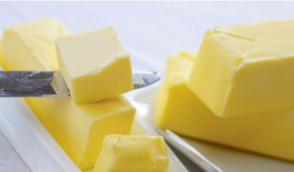
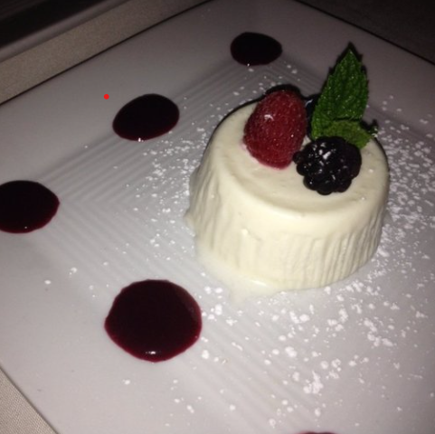
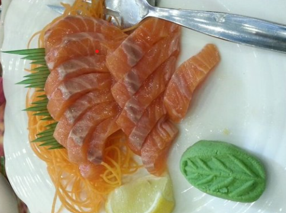

# Food Image Classification

This project demonstrates image classification for food type using deep learning techniques with TensorFlow.

## Dataset
The "Food-11_image" dataset from kaggle is used for training and evaluation. This dataset contains food images grouped in 11 major food categories. The dataset is split into training, validation, and evaluation sets.

 

## Requirements
- tensorFlow
- tensorflow_datasets
- matplotlib
- numpy
- pandas
- os
- re

## Usage
1. Clone the repository:
git clone <repository_url>

2. Install the required dependencies:
pip install tensorflow tensorflow-datasets matplotlib pandas

3. Run the script:
python ADN_rps.py

4. Training Process
- The script loads the dataset and performs data preprocessing.
- A convolutional neural network model based on InceptionV3 is defined.
- The model is trained on the training set with validation performed on the validation set.
- Training progress, including accuracy and loss, is displayed.

5. Evaluation
- The trained model is evaluated on the test set.
- Test accuracy and loss are reported.

6. Saving the Model
- The trained model is saved to the "food_classification" directory.

## Files
- `ADN_rps.py`: The main Python script for training and evaluating the model.
- `README.md`: This file providing detailed information about the project.
- `food_classification/`: Directory containing the saved model.

## License
This project is licensed under the [MIT License](LICENSE).

## Authors
- Apaurusheya Tripathi: [apaurusheyatripathi12@gmail.com](mailto:apaurusheyatripathi12@gmail.com)